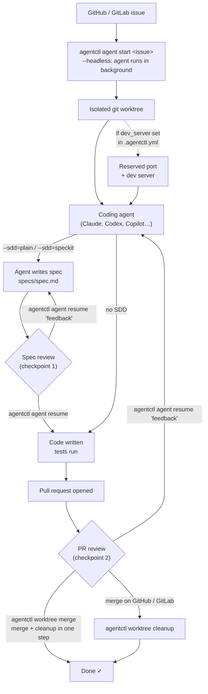

# agentctl

**agentctl** is a **Go** CLI that combines [git worktrees](https://git-scm.com/docs/git-worktree), coding agents, and optional spec-driven development (SDD) methodologies to tackle GitHub and GitLab issues in isolated workspaces, with pluggability across both agents and SDD workflows.

| Coding agents | SDD methodologies |
|---|---|
| [](https://www.anthropic.com/claude-code) (default)<br>[](https://github.com/openai/codex)<br>[](https://github.com/features/copilot)<br>[](https://openhands.dev/)<br>…and [any agent](docs/adapters.md) via a one-line YAML file | [**Spec Kit**](https://github.com/github/spec-kit) (`--sdd speckit`)<br>[**Plain**](docs/sdd.md) (`--sdd plain`)<br>…and [any methodology](docs/sdd.md) via a one-line YAML file |

## Install

**Homebrew** (macOS and Linux):

```bash
brew install arun-gupta/tap/agentctl
```

**Manual** — download a release archive, extract it, and move the binary onto your `PATH`:

```bash
# macOS (Apple Silicon)
curl -fsSL https://github.com/arun-gupta/agentctl/releases/latest/download/agentctl-darwin-arm64.tar.gz | tar -xz
sudo mv agentctl /usr/local/bin/
```

For other platforms, source builds, and subtree installs, see **[docs/install.md](docs/install.md)**.

## Upgrade

**Homebrew:**

```bash
brew update && brew upgrade agentctl
```

**Manual** — re-run the same `curl` command from Install to replace the binary.

## Quick start

```bash
# From your application repo's primary worktree
cd /path/to/your/app-repo
agentctl agent start 42

# Or from anywhere, using a full issue URL (GitHub or GitLab)
agentctl agent start https://github.com/owner/repo/issues/42
agentctl agent start https://gitlab.com/owner/repo/-/issues/42

# Or from your repo, using a free-form task
agentctl agent start --task "Refactor the auth middleware to use JWT"

# Back in your application repo's primary worktree
cd /path/to/your/app-repo
agentctl worktree cleanup 42
```

> **Backward-compat alias:** `agentctl start` still works and maps to `agentctl agent start`.

`agentctl --help` and `agentctl <command> --help` list all flags.

## How it works



For a deeper walkthrough see **[Introducing agentctl](docs/articles/introducing-agentctl.md)** and **[docs/cli.md](docs/cli.md)**.

## Documentation

- **[docs/articles/introducing-agentctl.md](docs/articles/introducing-agentctl.md)** — full walkthrough: the problem, how it works, quick start, batch mode, and SDD  
- **[docs/install.md](docs/install.md)** — prerequisites, install paths, releases  
- **[docs/cli.md](docs/cli.md)** — command reference and workflows  
- **[docs/sdd.md](docs/sdd.md)** — SDD overview, methodology YAML schema, resolution chain, drop-in locations  
- **[docs/adapters.md](docs/adapters.md)** — agent YAML schema, lookup hierarchy, drop-in locations, built-in adapters  
- **[docs/development.md](docs/development.md)** — contributor build, test, release, adapter contracts, CI  
- **[AGENTS.md](AGENTS.md)** — conventions for AI agents working in this repo  

## License

See [LICENSE](LICENSE).
