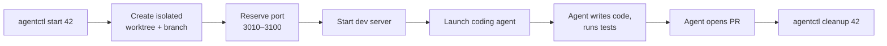
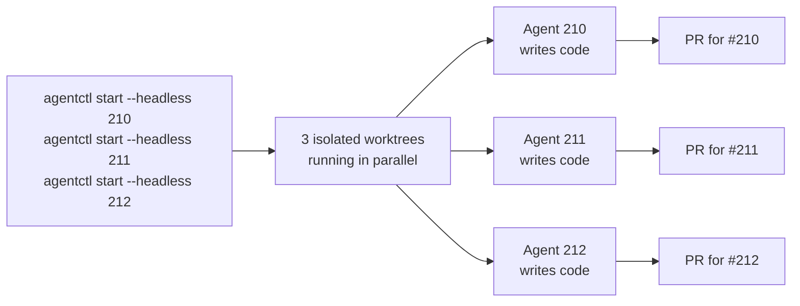
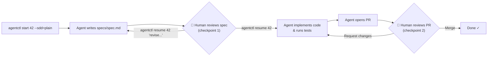

# Introducing agentctl

AI coding agents like Claude Code, Codex, and Copilot have become genuine productivity multipliers. Point one at a GitHub issue and it writes code, runs tests, and opens a pull request — often with minimal intervention. But what happens when you want to work on ten issues at once, or switch between different coding agents depending on the task?

Beyond parallelism, the industry has seen a wave of Spec-Driven Development (SDD) methodologies — frameworks like Spec Kit, AgentOS, OpenSpec, and Kiro-style specs that inject a human review checkpoint before an agent begins writing code. agentctl integrates all of these into a unified SDLC workflow, with human-in-the-loop at exactly the right moments.

This article walks through what agentctl is, why it exists, and how to get started.

## The problem

Running a single AI agent in a terminal works fine. Running several simultaneously surfaces a class of problems that agents themselves can't solve:

- **Git state collisions.** Agents commit to branches. Without isolation, two agents in the same working tree will conflict with each other and with your own uncommitted edits.
- **Port conflicts.** Each agent typically starts a dev server. Without coordination, the second agent fails to bind `localhost:3000` because the first already holds it.
- **No shared visibility.** A fleet of terminal tabs gives you no consolidated view of what's running, what's paused waiting for review, and what's already opened a PR.
- **Manual lifecycle management.** Starting, watching, and cleaning up worktrees by hand is tedious and error-prone at scale.
- **Agent lock-in.** Different tasks suit different coding agents. Switching from Claude to Codex today means re-configuring your workflow from scratch.
- **SDD integration.** Spec-driven methodologies require a human-in-the-loop approval gate between spec and implementation. Coordinating this across parallel agents — each potentially following a different SDD flavor — is error-prone without dedicated tooling.

agentctl solves all of the above. Every coding agent and every SDD methodology is pluggable — you can mix and match them per issue.

## What agentctl does

agentctl is a CLI that manages the full lifecycle of AI coding agents working on GitHub issues. For each issue you give it:

1. **Isolated worktree** — agentctl creates a [linked Git worktree](https://git-scm.com/docs/git-worktree) at `../<repo>-<issue>-<slug>/`. Every agent works in its own directory with its own branch; they never share an index or conflict with your primary checkout.
2. **Reserved port** — agentctl picks a free port in the `3010–3100` range, writes `PORT=<port>` into the worktree's `.env.local`, and starts the dev server there. No two agents fight over the same port.
3. **Structured lifecycle** — each worktree gets a `.agent` metadata file that tracks the agent name, session ID, and process IDs. `agentctl status` reads these across all worktrees and shows a consolidated table.
4. **One command per issue** — `agentctl start 42` handles worktree creation, environment seeding, dev server startup, and agent launch. `agentctl cleanup 42` reverses it after the PR merges.

agentctl is **agent-agnostic and fully pluggable**. The default adapter is Claude Code (`claude`), but `--agent codex`, `--agent copilot`, `--agent gemini`, and `--agent opencode` are all built in. Adding support for a new coding agent takes a single line of YAML:

```yaml
binary: cursor-agent
```

Optional fields let you customise prompt flags, session IDs, and full command strings. Drop the YAML file into `.agentctl/adapters/` and the agent is immediately available. See [adapters.md](../adapters.md) for the full schema, built-in adapters, and drop-in locations.

## Quick start



### Install

```bash
# macOS / Linux via Homebrew (recommended)
brew install arun-gupta/tap/agentctl
```

See [install.md](../install.md) for prebuilt binaries and source builds.

### Start an agent on an issue

```bash
# From your application repo's primary worktree
agentctl start 42
```

agentctl creates a linked worktree, reserves a port, starts the dev server, and launches Claude Code — all in one step. Agent output streams live to your terminal so you can follow along.

### Check what's running

While the agent works, open a second terminal and run:

```bash
agentctl status
```

Output looks like:

```text
ISSUE  BRANCH            AGENT   PORT  SPEC      PR
42     42-fix-login      claude  3010  no-spec   none
```

The `ISSUE` column is your key. `PORT` tells you where the dev server is listening. `SPEC` shows which SDD methodology is active — `no-spec` means the agent is working directly toward a PR with no spec checkpoint; a value like `plain` or `speckit` means spec-driven development is enabled for that issue. `PR` updates once the agent opens a pull request.

### Clean up after merge

Once the PR for issue 42 is merged:

```bash
agentctl cleanup 42
```

This pulls `main`, stops the dev server and agent processes, removes the linked worktree, and deletes the local and remote branches. Your primary checkout is left clean.

## Headless / batch mode

The quick-start workflow keeps the agent attached to your terminal. For running several issues in parallel — or for CI-style automation — use `--headless`:



```bash
# Start three issues in parallel
for i in 210 211 212; do
  agentctl start --headless "$i"
done
```

Each agent runs in the background and writes its output to `agent.log` inside its worktree. You get your prompt back immediately.

Monitor the fleet:

```bash
agentctl status
```

Tail a specific agent's log:

```bash
agentctl logs 211
```

Attach and wait until an agent finishes — identical to the interactive experience, but for an already-running headless agent:

```bash
agentctl attach 211
```

When all three have opened PRs, sweep everything in one pass:

```bash
agentctl cleanup --all   # cleans up any worktree whose PR is MERGED
```

## Spec-driven development (SDD)

By default, `agentctl start` sends the agent straight to implementation: write code, push branch, open PR. This works well when the GitHub issue already includes enough implementation detail for the agent to proceed confidently.

When the issue is high-level or leaves room for interpretation, it's better to route through SDD: have the agent first write a spec describing its intended approach, review it yourself, then let the agent proceed to code. This human-in-the-loop checkpoint prevents expensive rework when the agent's interpretation diverges from your intent.



### Pluggable SDD

SDD in agentctl is fully pluggable. `plain` is the default built-in methodology — a lightweight single-file spec workflow with one approval gate and no slash commands. Use it in any repo without any setup:

```bash
agentctl start 42 --sdd=plain
```

The agent's work now has two stages:

1. **Stage 1 — spec.** The agent writes `specs/spec.md` describing its intended approach, then pauses and waits for your review. A good plain spec covers: the problem being solved, the planned approach and changes, and anything explicitly out of scope. **This is human-in-the-loop checkpoint #1.**
2. **Stage 2 — implementation.** After your review and approval, the agent continues to a PR. **The PR review itself is human-in-the-loop checkpoint #2.**

To approve and let the agent proceed:

```bash
agentctl resume 42
```

To send revision feedback instead:

```bash
agentctl resume 42 "Narrow scope to the API layer; avoid UI changes."
```

### Other SDD methodologies

The `--sdd=plain` methodology requires no external tooling — it works in any repo. For repos configured with Spec Kit, `--sdd=speckit` runs a richer four-stage lifecycle. You can also define your own methodology by dropping a YAML file into `.agentctl/sdd/`. See [sdd.md](../sdd.md) for details.

More built-in methodologies are planned — each tracked as an open issue and available today as a custom YAML drop-in:

| Methodology | Tracking issue |
|-------------|---------------|
| AgentOS | [#35](https://github.com/arun-gupta/agentctl/issues/35) |
| Specs.MD | [#36](https://github.com/arun-gupta/agentctl/issues/36) |
| OpenSpec | [#38](https://github.com/arun-gupta/agentctl/issues/38) |
| Kiro-style specs | [#39](https://github.com/arun-gupta/agentctl/issues/39) |

## What's next

- **[install.md](../install.md)** — full prerequisites, Homebrew, prebuilt binaries, and source builds.
- **[cli.md](../cli.md)** — complete command reference: every flag, every workflow, state files, and recovery operations.
- **[sdd.md](../sdd.md)** — SDD overview, built-in methodologies (`plain`, `speckit`), the YAML schema for custom methodologies, and drop-in locations.
- **[adapters.md](../adapters.md)** — YAML adapter schema for adding new coding agents, built-in adapter reference, and drop-in locations.

## This is evolving work — we'd love your help

agentctl is actively evolving. The patterns it encodes — parallel worktrees, reserved ports, spec-driven checkpoints — have emerged from real workflows, but every project is different.

If you try agentctl on your own codebase and run into something that doesn't fit, we want to hear about it. [Open an issue](https://github.com/arun-gupta/agentctl/issues) describing your use case: the kind of repo, the agents you're running, and where agentctl falls short. That feedback directly shapes what gets built next.
