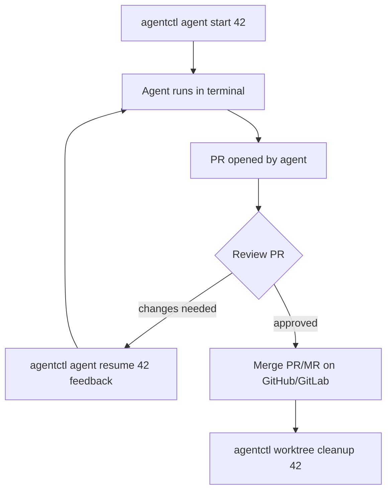
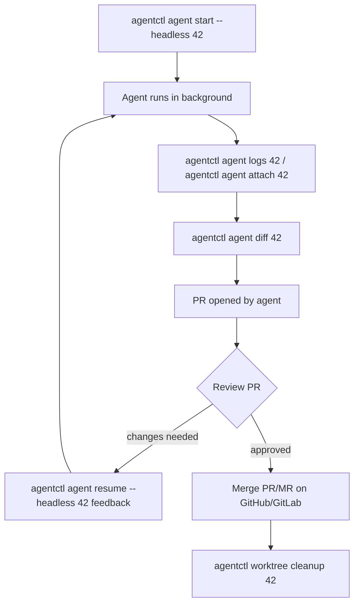
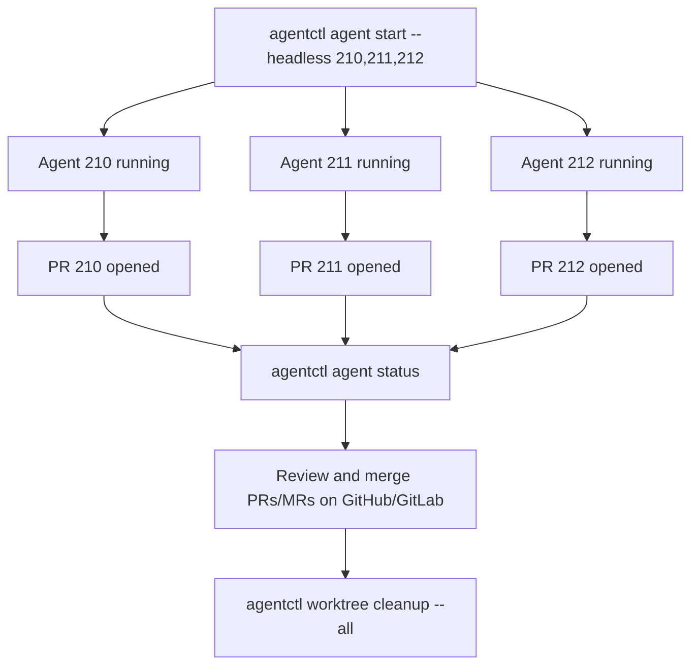
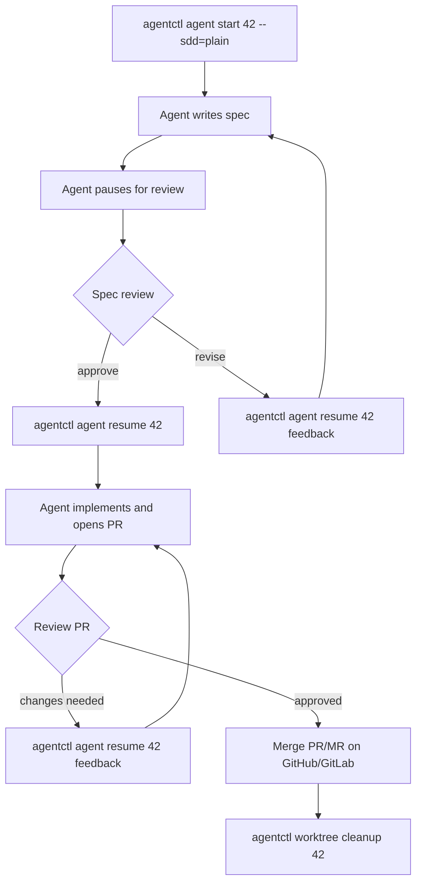

# CLI reference and workflows

Canonical command reference and operating workflows for **agentctl**.

Run `agentctl --help` or `agentctl <command> --help` for generated help from the binary.

---

## Table of contents

- [Workflows](#workflows)
  - [Interactive workflow](#interactive-workflow)
  - [Headless workflow](#headless-workflow)
  - [Batch headless workflow](#batch-headless-workflow)
  - [Spec-driven development (SDD)](#spec-driven-development-sdd)
  - [Recovery and maintenance](#recovery-and-maintenance)
- [Command reference](#command-reference)
  - [agent group](#agent-group)
    - [agentctl agent start](#agentctl-agent-start)
    - [agentctl agent status](#agentctl-agent-status)
    - [agentctl agent logs](#agentctl-agent-logs)
    - [agentctl agent attach](#agentctl-agent-attach)
    - [agentctl agent diff](#agentctl-agent-diff)
    - [agentctl agent resume](#agentctl-agent-resume)
  - [worktree group](#worktree-group)
    - [agentctl worktree merge](#agentctl-worktree-merge)
    - [agentctl worktree cleanup](#agentctl-worktree-cleanup)
    - [agentctl worktree discard](#agentctl-worktree-discard)
    - [agentctl worktree open](#agentctl-worktree-open)
  - [Dev server](#dev-server)
    - [agentctl dev start](#agentctl-dev-start)
  - [Build](#build)
    - [agentctl build](#agentctl-build)
  - [Report](#report)
    - [agentctl report](#agentctl-report)
  - [Info](#info)
    - [agentctl info](#agentctl-info)
  - [Setup](#setup)
    - [agentctl setup](#agentctl-setup)
  - [Backward-compat alias](#backward-compat-alias)
    - [agentctl start](#agentctl-start)
- [Global user config](#global-user-config)
- [`.agentctl.yml` configuration](#agentctlyml-configuration)
- [Desktop notifications](#desktop-notifications)
- [Worktree state files](#worktree-state-files)
- [Related docs](#related-docs)

---

## Workflows

### Interactive workflow

The agent runs in your terminal with its output streamed live.



```bash
# Start — agent streams output to your terminal
agentctl agent start 42

# Or using a full issue URL (works from any directory — GitHub or GitLab)
agentctl agent start https://github.com/owner/repo/issues/42
agentctl agent start https://gitlab.com/owner/repo/-/issues/42

# Suppress log output but still wait for the agent to finish
agentctl agent start --quiet 42

# Check what the agent has changed so far
agentctl agent diff 42

# Request changes after reviewing the PR
agentctl agent resume 42 "Narrow scope to the API layer; avoid UI changes."

# After the PR is merged
agentctl worktree cleanup 42
```

### Headless workflow

The agent runs in the background; you check in at your own pace.



```bash
# Start in the background; get a desktop notification when done
agentctl agent start --headless --notify 42

# Stream logs live
agentctl agent logs 42

# Or attach and wait for the agent to finish automatically
agentctl agent attach 42

# Inspect what the agent changed
agentctl agent diff 42
agentctl agent diff 42 --stat

# Request changes (resumes in background to match original headless behaviour)
agentctl agent resume --headless 42 "Add error handling for the edge case."

# After the PR is merged
agentctl worktree cleanup 42
```

### Batch headless workflow



```bash
# Start several issues at once
agentctl agent start --headless 210,211,212

# Monitor all worktrees
agentctl agent status
agentctl agent status --verbose

# Review what each agent changed
agentctl agent diff 210 --stat
agentctl agent diff 211 --stat

# Approve each spec in background
agentctl agent resume --headless 210
agentctl agent resume --headless 211
agentctl agent resume --headless 212

# Sweep all merged PRs
agentctl worktree cleanup --all
```

### Spec-driven development (SDD)



`agentctl agent start 42` works out of the box for any repo — by default there is no spec step and the agent opens a PR directly.

Use `--sdd=plain` to add a lightweight spec-review checkpoint (no external tooling required):

```bash
agentctl agent start 42 --sdd=plain
```

Use `--sdd=speckit` to opt into the Spec Kit workflow if your repo is set up for it:

```bash
agentctl agent start 42 --sdd=speckit
```

See [sdd.md](sdd.md) for the SDD methodology schema and drop-in locations.

### Recovery and maintenance

```bash
# Discard abandoned work (unrecoverable — prompts for YES)
agentctl worktree discard 42

# Discard all worktrees with no running agent and no PR
agentctl worktree discard --stale

# Run cleanup/discard from inside a linked worktree (no issue number needed)
cd ../myrepo-42-my-feature
agentctl worktree cleanup
agentctl worktree discard

# Inspect state
agentctl agent status --verbose
cat ../<repo>-42-<slug>/.agent
tail -f ../<repo>-42-<slug>/agent.log
tail -f ../<repo>-42-<slug>/dev.log
```

---

## Command reference

### agent group

#### `agentctl agent start`

```bash
agentctl agent start [--agent <name>] [--headless] [--notify] [--quiet] <issue-number-or-url> [slug] [--sdd=<name>]
agentctl agent start [--agent <name>] [--headless] [--notify] [--quiet] [--sdd=<name>] --task "<description>" [--branch <branch-name>]
```

Creates a linked worktree for a GitHub or GitLab issue (or a free-form task) and launches the selected coding agent inside it.

- `--agent <name>`: adapter name; default is `claude`. See [adapters.md](adapters.md) for available adapters.
- `--headless`: run the agent in the background and write agent output to `agent.log`.
- `--notify`: send a native desktop notification when the headless agent finishes. No-op when `--headless` is not set. See [Desktop notifications](#desktop-notifications).
- `--quiet`: suppress all agent log output in the terminal; the parent still waits for the agent to finish (foreground). Has no effect with `--headless`.
- `--sdd=<name>`: opt into an SDD methodology (e.g. `--sdd=plain`, `--sdd=speckit`). Omit to skip SDD and work directly toward a PR. See [sdd.md](sdd.md).
- `--task "<description>"`: start from a free-form task description instead of an issue.
- `--branch <branch-name>`: explicit branch name for `--task`. Only valid with `--task`.
- `<issue-number-or-url>`: a bare issue number (e.g. `42`) **or** a full issue URL from GitHub (`https://github.com/owner/repo/issues/42`) or GitLab (`https://gitlab.com/owner/repo/-/issues/42`). When a URL is supplied, `agentctl` locates or clones the target repository automatically so you do not need to `cd` into it first. The VCS provider is detected from the repository's git origin.
- `[slug]`: optional branch/worktree slug. If omitted, `agentctl` fetches the issue title from the VCS provider (via `gh` for GitHub, `glab` for GitLab) and derives a slug.

Side effects:

- Issue mode: creates a branch named `<issue>-<slug>` and a worktree at `../<repo>-<issue>-<slug>/`.
- Task mode: creates a branch named `task/<slug>` by default and a worktree at `../<repo>-task-<slug>/`. `--branch` overrides the branch name verbatim and uses the slash-replaced branch name in the worktree path.
- Reserves a dev-server port in the `3010-3100` range.
- Writes `.agent` metadata in the worktree.
- Seeds `.env.local` from the primary worktree when present, stripping any existing `PORT=` lines (does not inject `PORT=<port>` itself).
- Starts the dev server: if `.agentctl.yml` defines a `dev_server` command it is used (with `{port}` substituted); otherwise the step is silently skipped. Any project that needs a dev server must set `dev_server` explicitly in `.agentctl.yml`.
- Launches the selected adapter.
- In issue mode, when the agent exits, appends `Closes #<issue>` to the PR body retrieved via `gh pr view <branch>`, unless the body already contains `closes #<issue>` or `fixes #<issue>` (case-insensitive).

#### `agentctl agent status`

```bash
agentctl agent status
agentctl agent status --verbose
agentctl agent list
```

Shows all linked worktrees and their current state.

Default columns:

```text
ISSUE  BRANCH  AGENT  PORT  SPEC  PR
```

Verbose columns:

```text
ISSUE  BRANCH  AGENT  PATH  PORT  DEV-PID  AGENT-PID  SPEC  PR  SESSION
```

Spec states:

- `no-spec`: no spec found for the issue.
- `paused`: `spec.md` exists, but no `plan.md` or `tasks.md`.
- `in-progress`: `plan.md` exists, but no `tasks.md`.
- `done`: `tasks.md` exists.

PR column shows the PR number and state from `gh pr view <branch>`, e.g. `#42 OPEN`, `#42 MERGED`. Shows `none` when no PR exists for the branch.

#### `agentctl agent logs`

```bash
agentctl agent logs <issue-number-or-url>
agentctl agent logs <issue-number-or-url> --lines 100
agentctl agent logs <issue-number-or-url> --no-follow
```

Streams `agent.log` for the given issue to stdout.

Flags:

| Flag | Default | Description |
|------|---------|-------------|
| `--lines N` | `50` | Lines of history to show before following |
| `--no-follow` | `false` | Print history and exit without following |

Behavior:

- Looks up the worktree path from state (same as `agentctl agent status`).
- Prints the last `--lines N` lines of `agent.log`.
- Then follows new output until Ctrl+C (unless `--no-follow` is set).
- If `agent.log` does not exist yet, waits up to 10 seconds for it to appear.

Error cases:

| Condition | Error message |
|-----------|---------------|
| Issue not found | `no worktree found for issue N — has it been started?` |
| `agent.log` missing after 10s | `agent log not found — is the agent running? (looked for <path>)` |

#### `agentctl agent attach`

```bash
agentctl agent attach <issue-number-or-url>
```

Streams `agent.log` and exits automatically when the agent process finishes — mirrors the non-headless `start` experience for an already-running headless agent.

Behavior:

- Looks up the worktree path from state and reads the agent PID from `.agent`.
- If the agent is already dead: prints the last 50 lines of `agent.log` and prints `agent has already finished`.
- If the agent is still running: streams `agent.log` to stdout and exits when the process ends.
- On Ctrl+C: prints `agent still running in background (pid N)` and exits without killing the agent.

Error cases:

| Condition | Error message |
|-----------|---------------|
| Issue not found | `no worktree found for issue N — has it been started?` |
| `.agent` file missing or no PID | `no agent PID recorded for issue N — was it started headless?` |
| `agent.log` missing after 10s | `agent log not found — is the agent running? (looked for <path>)` |

#### `agentctl agent diff`

```bash
agentctl agent diff <issue-number-or-url>
agentctl agent diff <issue-number-or-url> --stat
agentctl agent diff <issue-number-or-url> --base <branch>
agentctl agent diff <issue-number-or-url> --no-pager
```

Shows the git diff for the agent's worktree without leaving your primary working directory.

Flags:

| Flag | Default | Description |
|------|---------|-------------|
| `--stat` | `false` | Show changed-file summary instead of full diff |
| `--base <branch>` | — | Diff base branch; uses `<branch>...HEAD` (three-dot) to show only commits the agent added |
| `--no-pager` | `false` | Print raw diff to stdout without paging |

Behavior:

- Resolves the worktree path for the given issue (same lookup as `agentctl agent logs`).
- Without `--base`: runs `git diff HEAD` — shows all uncommitted changes (staged + unstaged).
- With `--base <branch>`: runs `git diff <branch>...HEAD` — shows everything the agent added since branching from `<branch>`.
- Output is piped through `$PAGER` (defaulting to `less -R`) with `--color=always` when stdout is a TTY.
- `--stat` and `--no-pager` skip the pager and print directly to stdout.

Error cases:

| Condition | Error message |
|-----------|---------------|
| Issue not found | `no worktree found for issue N — has it been started?` |

#### `agentctl agent resume`

```bash
agentctl agent resume [--headless] [--notify] [--quiet] <issue-number-or-url>
agentctl agent resume [--headless] [--notify] [--quiet] <issue-number-or-url> [feedback]
```

Resumes a paused agent after the spec-review checkpoint.

- Without feedback: approves the spec and the agent begins implementation.
- With feedback: sends the revision text and the agent rewrites the spec.

By default the resumed agent streams its output to the terminal (foreground mode), identical to `agentctl agent start` without `--headless`. Press Ctrl+C to detach without stopping the agent.

- `--headless`: run the resumed agent in the background and write output to `agent.log`.
- `--notify`: send a native desktop notification when the headless agent finishes. No-op when `--headless` is not set. See [Desktop notifications](#desktop-notifications).
- `--quiet`: suppress all agent log output in the terminal; the parent still waits for the agent to finish (foreground). Has no effect with `--headless`.

`--agent` is not accepted by `resume` — the agent is recorded in `.agent` at `start` time and reused automatically.

The command requires:

- A linked worktree for the issue.
- A `.agent` metadata file with the selected agent and session ID.
- A generated spec at `specs/*/spec.md`.

### worktree group

#### `agentctl worktree merge`

```bash
agentctl worktree merge [issue-number-or-url]
agentctl worktree merge [issue-number-or-url] --strategy squash|merge|rebase
agentctl worktree merge [issue-number-or-url] --dry-run
agentctl worktree merge [issue-number-or-url] --no-delete
```

One-step merge: verifies the PR is approved and mergeable, runs `gh pr merge`, pulls `main`, and removes the worktree and branches. Equivalent to merging on GitHub/GitLab and then running `agentctl worktree cleanup`, but in a single command.

Run without arguments inside a linked worktree to infer the issue from the current branch.

Flags:

| Flag | Default | Description |
|------|---------|-------------|
| `--strategy <name>` | `squash` | Merge strategy: `squash`, `merge`, or `rebase`. Overrides `merge_strategy` in `.agentctl.yml`. |
| `--no-delete` | `false` | Skip worktree and branch deletion after merge; leaves the worktree intact |
| `--dry-run` | `false` | Show what would happen without executing any destructive steps |
| `--agent <name>` | — | Disambiguate when multiple worktrees exist for the same issue |

Strategy resolution order: `--strategy` flag → `merge_strategy` in `.agentctl.yml` → `squash`.

Error cases:

| Condition | Error message |
|-----------|---------------|
| Issue not found | `no worktree or local branch found for issue N` |
| PR not merged-ready | `PR is not in a mergeable state` |
| Unknown strategy | `unknown merge strategy "<name>": must be squash, merge, or rebase` |

#### `agentctl worktree cleanup`

```bash
agentctl worktree cleanup [issue-number-or-url]
agentctl worktree cleanup --all
```

Cleans up a worktree after its PR is merged.

Behavior:

- Infers the issue number from the current branch when run inside a linked worktree and no issue is provided.
- Ensures the primary worktree is on `main`.
- Verifies the branch PR is `MERGED` via `gh`.
- Pulls `main` with fast-forward only.
- Stops recorded dev/agent PIDs when possible.
- Removes the linked worktree.
- Deletes local and remote branches.

Use `--all` to scan all linked worktrees and run the cleanup flow for every branch whose PR state is `MERGED`. Also prunes orphaned remote branches (branches with no local worktree whose PR is MERGED or CLOSED). Branches without PRs, unmerged PRs, detached worktrees, or branches without a numeric issue prefix are skipped.

If the PR is not merged, use `agentctl worktree discard` for abandoned work.

#### `agentctl worktree discard`

```bash
agentctl worktree discard [issue-number-or-url]
agentctl worktree discard --stale
```

Permanently discards a worktree and deletes local/remote branches. This is unrecoverable and prompts for `YES`.

Use this for abandoned or failed work where the PR should not be merged.

Like `cleanup`, the issue number can be inferred from the current branch when run inside a linked worktree.

Use `--stale` to discard all linked worktrees at once that have no running agent and no PR. All matching worktrees are listed before the confirmation prompt. `--stale` and a positional issue number are mutually exclusive.

A worktree is considered stale when both conditions hold:
1. No agent is running (no `.agent` file, empty `agent-pid`, or the recorded PID is not alive).
2. No PR of any state exists for the branch (`gh pr list --state all` returns no results).

When `agentctl worktree cleanup --all` skips worktrees with no PR, it prints a hint if any of them are also stale:

```
Note: N stale worktree(s) found with no agent and no PR — run `agentctl worktree discard --stale` to remove them.
```

#### `agentctl worktree open`

```bash
agentctl worktree open <issue-number-or-url>
agentctl worktree open <issue-number-or-url> --editor code
agentctl worktree open <issue-number-or-url> --editor cursor
cd $(agentctl worktree open <issue-number-or-url> --path)
```

Opens the worktree for an issue in the configured editor.

Editor resolution order:

1. `--editor` flag (per-invocation override)
2. `editor` key in `.agentctl.yml`
3. `AGENTCTL_EDITOR` env var
4. `VISUAL` env var
5. `EDITOR` env var
6. Falls back to printing the worktree path if none are set

Flags:

| Flag | Default | Description |
|------|---------|-------------|
| `--editor <name>` | — | Editor to open the worktree in; overrides config and env vars |
| `--path` | `false` | Print the worktree path to stdout without opening an editor |
| `--agent <name>` | — | Disambiguate when multiple worktrees exist for the same issue |

Behavior:

- Resolves the linked worktree path for the given issue.
- Launches the editor with the worktree path as a non-blocking background process (`.Start()`, not `.Run()`), so the command returns immediately.
- When no editor is resolved, prints the worktree path to stdout and exits with no error — same as `--path`.
- `--path` is useful for scripting: `cd $(agentctl worktree open 42 --path)`.

Error cases:

| Condition | Error message |
|-----------|---------------|
| Issue not found | `no worktree found for issue N — has it been started?` |
| Editor binary not found | `cannot open editor "<name>": ...` |

### Dev server

#### `agentctl dev start`

```bash
agentctl dev start [issue]
agentctl dev start [issue] --quiet
```

Launches the `dev_server` command from `.agentctl.yml` using the port already recorded in `.agent`. Does **not** allocate a new port — use this when the dev server was skipped during `agentctl agent start` (e.g. `.agentctl.yml` was added mid-PR) or after it crashed.

Run without arguments inside a linked worktree to infer the issue number from the current branch.

Flags:

| Flag | Default | Description |
|------|---------|-------------|
| `--quiet` | `false` | Suppress log streaming; only print the ready URL |

Behavior:

- Reads the port from `.agent` (set by `agentctl agent start`).
- Checks that the dev server is not already running; exits 1 if it is.
- Starts `dev_server` with `{port}` substituted, writing output to `dev.log`.
- Prints `Dev server ready → http://localhost:<port>` to stdout.
- Sends an OS notification when ready if `notify: true` in `.agentctl.yml`.
- Default: streams `dev.log` to stdout until Ctrl+C or the process exits.
- `--quiet`: prints the URL and exits immediately.
- Records the new dev server PID in `.agent` so `agentctl worktree cleanup` can tear it down.

Error cases:

| Condition | Error message |
|-----------|---------------|
| `dev_server` not set in `.agentctl.yml` | `dev_server not set in .agentctl.yml — nothing to start` |
| `.agent` has no port recorded | `no port recorded in .agent — run agentctl agent start first` |
| Dev server already running | `dev server already running (PID N) — stop that process and clear the recorded dev-pid before restarting` |
| Port already in use | `port N already in use` (with PID if detectable) |

### Build

#### `agentctl build`

```bash
agentctl build <issue>
agentctl build <issue> --output <path>
```

Compile a binary from the worktree associated with an issue. Useful for smoke-testing a build before or instead of running the full test suite.

Source resolution order:

1. Linked worktree exists — build directly from the worktree.
2. No worktree, but a local branch exists — check out into a temporary worktree, build, then remove it.
3. Neither — error with a clear message.

Build command resolution:

1. `build_cmd` in `.agentctl.yml` (use `{output}` as the binary path placeholder).
2. `go.mod` present → `go build -o {output} ./cmd/<first-subdir>` (or `./` if none).
3. `package.json` with a `build` script → `npm run build`.
4. `Makefile` with a `build` target → `make build`.

The built binary path is printed to stdout on success.

Flags:

| Flag | Default | Description |
|------|---------|-------------|
| `--output <path>` / `-o` | `/tmp/<repo>-<issue>` | Output path for the compiled binary |
| `--agent <name>` | — | Disambiguate when multiple worktrees exist for the same issue |

### Report

#### `agentctl report`

```bash
agentctl report
agentctl report --json
```

Prints an aggregate summary of all agent runs recorded in `.agentctl/runs/` in the current repository.

Default output shows period aggregates (last 7 and 30 days) and the slowest individual runs.

Flags:

| Flag | Default | Description |
|------|---------|-------------|
| `--json` | `false` | Emit all run records as a JSON array suitable for piping into dashboards or cost-accounting scripts |

### Info

#### `agentctl info`

```bash
agentctl info
agentctl info --no-unicode
```

Prints a diagnostics report useful for troubleshooting: agentctl version, OS/arch, prerequisite tool availability (`git`, `gh`), available coding agents, current configuration (global and project-local), and active worktrees.

Flags:

| Flag | Default | Description |
|------|---------|-------------|
| `--no-unicode` | `false` | Use ASCII markers (`OK`/`X`) instead of Unicode glyphs (`✓`/`✗`). Also honored via `AGENTCTL_ASCII=1`. |

### Setup

#### `agentctl setup`

```bash
agentctl setup
```

Interactive setup wizard for new developers. Checks prerequisites (`git`, GitHub CLI), shows available coding agents, and prompts for preferences (default agent, notifications, SDD methodology). Preferences are saved to the global config file (`~/.config/agentctl/config.yml`).

No flags beyond `--help`.

### Backward-compat alias

`agentctl start` is a hidden top-level alias that maps directly to `agentctl agent start`. All flags and arguments are identical. Existing scripts and muscle memory continue to work unchanged.

---

## Global user config

Place a config file at `~/.config/agentctl/config.yml` (or `$XDG_CONFIG_HOME/agentctl/config.yml`) to set personal defaults that apply across all repositories.

### Config resolution chain

```
CLI flags  >  project-local .agentctl.yml  >  global config.yml  >  built-in defaults
```

This matches the pattern used by `git`, `gh`, `npm`, and `kubectl`. Project-local `.agentctl.yml` always wins for any field it explicitly sets.

### Global-eligible fields

Only user-preference fields belong in the global config. Repo-specific fields (`dev_server`, `test_cmd`, `build_cmd`, `vcs`) are ignored in the global file.

```yaml
# ~/.config/agentctl/config.yml

# Personal default agent for agentctl agent start.
default_agent: codex

# Send desktop notifications when headless agents finish.
notify: true

# Personal default merge strategy.
merge_strategy: squash

# Editor opened by agentctl worktree open.
editor: cursor

# Opt out of per-run diagnostics globally.
diagnostics:
  enabled: false
```

### `notify` and `*bool` semantics

`notify` is stored as a nullable boolean so an explicit `notify: false` in a project-local `.agentctl.yml` can override a global `notify: true`. Omitting `notify` in `.agentctl.yml` means "inherit from global".

### Viewing effective config

`agentctl info` shows both the global config and the project-local config:

```
Global config: ~/.config/agentctl/config.yml
  default_agent: codex
  notify: true

Configuration: .agentctl.yml found
  dev_server: npm run dev -- --port {port}
```

If the global config file does not exist, `agentctl info` shows:

```
Global config: none
```

---

## `.agentctl.yml` configuration

Place `.agentctl.yml` in the root of your application repository to set per-repo defaults. All fields are optional.

```yaml
# Shell command to start the dev server. {port} is substituted with the
# reserved port. If omitted, no dev server is started (silently skipped).
dev_server: "uvicorn main:app --port {port}"

# Port agentctl allocated for the dev server (3010–3100 range). This value is
# written and managed by agentctl; do not set it manually.
port: 3010

# Send a native desktop notification when a headless agent finishes.
# Can also be enabled per-invocation with --notify.
notify: true

# Editor opened by agentctl worktree open. Overridden per-invocation with --editor.
# Examples: "cursor", "code", "idea"
editor: cursor

# Default coding agent for agentctl agent start. Overrides the built-in default
# ("claude"). Overridden per-invocation with --agent.
# Examples: "codex", "copilot", "gemini"
default_agent: claude

# Command agents use to run the test suite before opening a PR. When set,
# agents use this instead of inferring the command from AGENTS.md or README.md.
# Use {output} as a placeholder for the binary path (agentctl build only).
# Examples: "go test ./...", "npm test", "pytest tests/ -v"
test_cmd: pytest tests/ -v

# Default merge strategy for agentctl worktree merge. Overridden per-invocation with
# --strategy. Valid values: squash (default when omitted), merge, rebase.
merge_strategy: squash
```

---

## Desktop notifications

agentctl can fire a native OS notification the moment a headless agent finishes, so you don't have to poll `agentctl agent status` or watch `agent.log`.

### Enabling notifications

**Per-invocation** — pass `--notify` on `agent start` or `agent resume`:

```bash
agentctl agent start --headless --notify 42
agentctl agent resume --headless --notify 42
```

**Repo-wide default** — add `notify: true` to `.agentctl.yml`:

```yaml
notify: true
```

Either or both can be set; they combine with OR. `--notify` has no effect without `--headless`.

### Notification format

```
Title:   agentctl
Message: Agent finished — issue #42 (42-my-feature): succeeded
```

The message includes the issue number, branch name, and exit status (`succeeded` or `failed`).

### Platform support

| Platform | Tool | Notes |
|----------|------|-------|
| macOS | `osascript` | Built into macOS; no install required |
| Linux | `notify-send` | Provided by `libnotify-bin` on Debian/Ubuntu |
| Other | — | Silently no-ops; CI is unaffected |

---

## Worktree state files

Each started worktree contains:

```text
.agent          key=value metadata (agent, session-id, dev-pid, agent-pid)
agent.log       coding-agent output (streamed to terminal in interactive mode; only file in headless mode)
dev.log         dev-server output
specs/          SDD spec artifacts (e.g. spec.md, plan.md, tasks.md) when using SDD
```

The primary worktree is the first worktree reported by `git worktree list --porcelain`; linked worktrees are created next to it.

---

## Related docs

- [install.md](install.md) — prerequisites and installation.
- [sdd.md](sdd.md) — SDD overview, methodology schema, and drop-in locations.
- [development.md](development.md) — adapter contract, build, testing, and CI.
